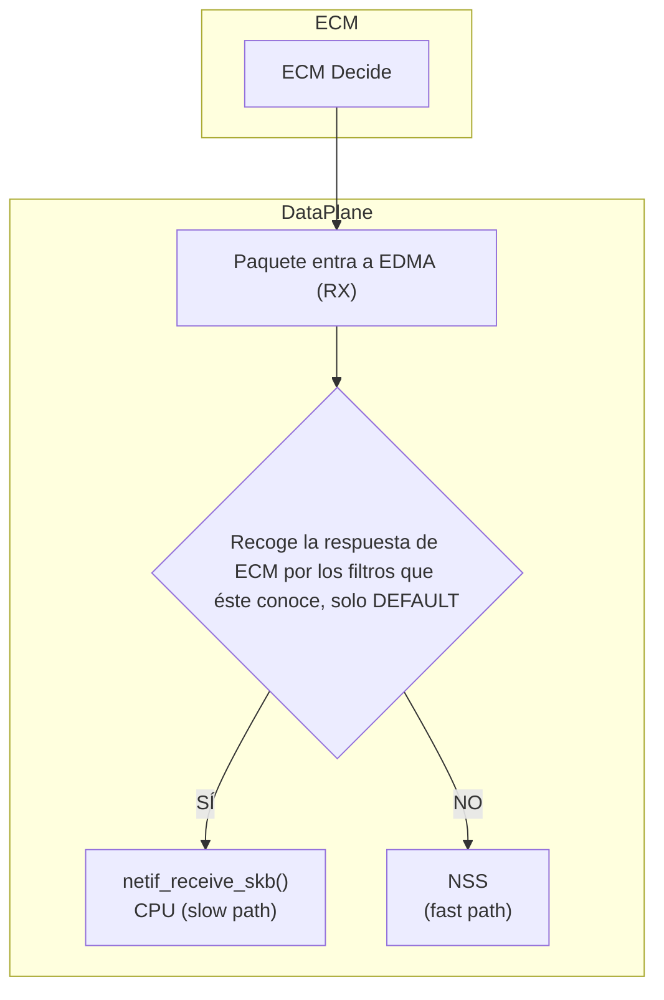
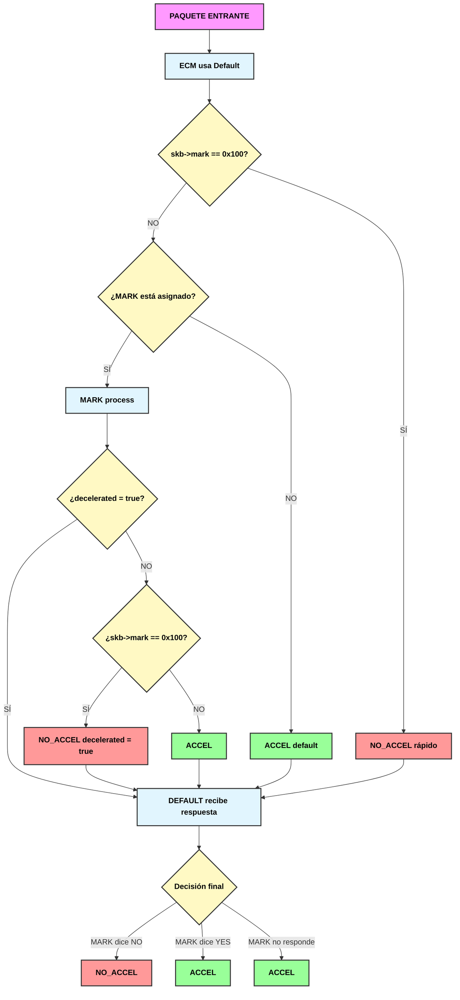
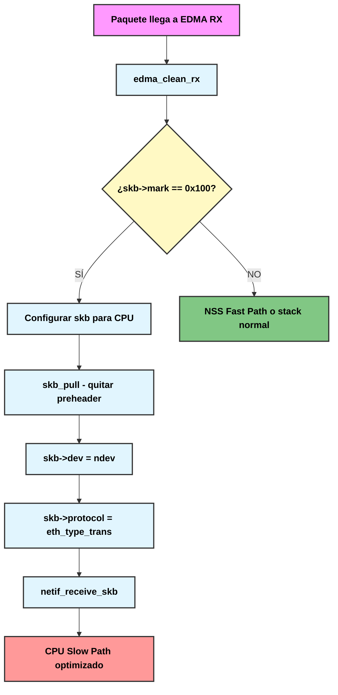
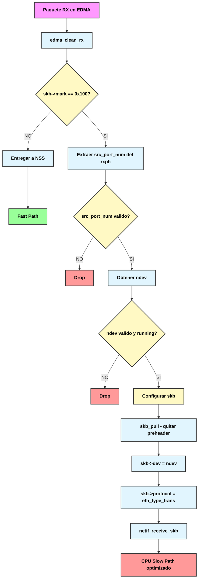
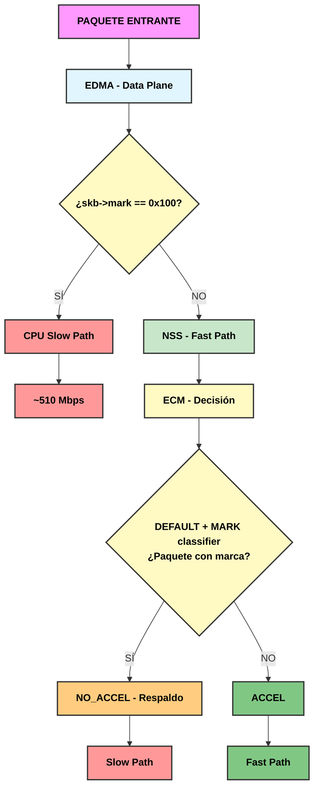

# NSS Bypas selectivo

## Proyecto: Filtro de Marca 0x100 en ECM y EDMA para Slow Path

- Hardware testado:     Xiaomi AX3600 (ipq808x)
- NSS Firmware:         NSS.HK.11.4.0.5-6-R
- Fecha                 2026. Aug. 04


1. [Objetivo](#1-objetivo)
2. [Arquitectura de la decisión](#2-arquitectura-de-la-decisión)
3. [Trabajo sobre el source code de Qualcomm](#3-trabajo-sobre-el-source-code-de-qualcomm)
4. [Cambios en qca-nss-ecm](#4-cambios-en-qca-nss-ecm)
5. [Cambios en qca-nss-dp](#5-cambios-en-qca-nss-dp)
6. [Marcar paquetes](#6-marcar-paquetes)
7. [Batería de pruebas](#7-batería-de-pruebas)


---

## 1. Objetivo

Forzar que cierto tráfico no sea acelerado por NSS Offload, permitiendo capturarlo con `tcpdump`, sin que otros flujos se vean interferidos, sin pérdida de rendimiento y sin saturar la CPU.

- PAQUETES A TRABAJAR:
    1. `qca-nss-ecm`
    2. `qca-nss-dp`

NSS permite ser desactivado por completo, o por segmentos IPv4/IPv6, como un sistema aparentemente monolítico. Es un "todo o nada".

Qualcomm dejó la mayoría de implementaciones para interferir y manipular NSS a medias, o completamente rotas, centrándose sólo en ese todo o nada.

Pero el sistema es cualquier cosa menos monolítico, y sí trabaja en base a distintas capas.


### 1. ECM

Una de estas capas es ECM, el cuál evalúa cada paquete y decide si debe pasarlo por NSS Offload (fast path), o debe ir a CPU (slow path).

Actualmente, este sistema de decisión es rudo y básico, no asigna ningún tipo de filtrado mas que:

> *"Todo va a NSS salvo que sea un tipo de paquete erróneo, o muy desconocido"*. 


En su implementación, Qualcomm parece que integró en el diseño inicial diferentes mecanismos auxiliares de decisión para ECM:
    1. Basado en clasificadores
    2. Por petición directa desde userspace vía mensajes NetLink
    3. Otros

Pero no desarrolló las implementaciones, o las dejó rotas.

El sistema de clasificadores para ECM parece bastante completo, con distintos marcadores que ayudan a tomar una decisión del tipo *"¿Es relevante este paquete para NSS?"*, con tres posibles estados:
    a. **_YES** → El clasificador afirma que debe acelerarse
    b. **_MAYBE** → El clasificador no tiene opinión
    c. **_NO** → El clasificador deniega la aceleración

Estos marcadores tienen su propio nivel de prioridad.

Antes de describir cuáles son, expliquemos cómo funciona un paquete (los flujos) en ECM de forma muy resumida:

1. Un paquete (y sus subsiguientes) se "descompone" en una serie de flujos. Sobre un paquete concreto:
    - **Flujo 1**: cabeceras (protocolo, IP, puertos, etc.)
    - **Flujo 2**: datos (payload)

2. ECM siempre analiza todos los paquetes:
    - Recoge el **Flujo 1** (cabeceras) y evalúa qué hacer con él, en base a sus reglas... o  consultando a los clasificadores o las reglas que el usuario le haya indicado vía NetLink o vía `ssdk_shell`(si todo esto hubiera sido implementado realmente por Qualcomm).  
    Como no tiene nada de eso implementado, usa su único criterio:  
     *"Todo va a NSS salvo que sean paquetes erróneos"*.
    
    - El **Flujo 2** (data flow) no es analizado en sí mismo. Siempre se procesa directamente en el fast path de NSS, **EXCEPTO** que la decisión de ECM haya sido *"No NSS"*, y entonces se procesa en CPU.

Por eso, hablamos de flujos de datos, que contienen los paquetes relacionados de esa conexión, desmembrados en varias partes.

**Ejemplo:**
- Un `ping -c 10` a `8.8.8.8` nos dará 20 paquetes (ida y vuelta).
- Esos 20 paquetes ECM los habrá descompuesto así:
    - **Flujo 1** (cabeceras): 20 trozos, las cabeceras de esos 20 paquetes.
    - **Flujo 2** (datos): otros 20 trozos, los datos de esos 20 paquetes (aunque en ping sean prácticamente nulos).
- Una vez terminado el ping, los flujos pasan de `ESTABLISHED` a `WAIT` y, si no hay más flujos idénticos (más pings a la misma IP, en este caso), dichos flujos son destruidos o reciclados.


Sobre los clasificadores que ECM podría haber tenido disponibles para inferir en sus decisiones, ordenados por prioridad sobre DEFAULT (de menor a mayor), tenemos:

| Posición | Clasificador | Macro | Prioridad |
| :---: | :--- | :--- | :--- |
| 1 | DEFAULT | `ECM_CLASSIFIER_TYPE_DEFAULT` | MÁS BAJA (siempre primero en el enum) |
| 2 | MARK | `ECM_CLASSIFIER_TYPE_MARK` | Mayor que DEFAULT |
| 3 | HYFI | `ECM_CLASSIFIER_TYPE_HYFI` | Mayor que MARK |
| 4 | DSCP | `ECM_CLASSIFIER_TYPE_DSCP` | Mayor que HYFI |
| 5 | MSCS | `ECM_CLASSIFIER_TYPE_MSCS` | Mayor que DSCP |
| 6 | WIFI | `ECM_CLASSIFIER_TYPE_WIFI` | Mayor que MSCS |
| 7 | EMESH | `ECM_CLASSIFIER_TYPE_EMESH` | Mayor que WIFI |
| 8 | NL | `ECM_CLASSIFIER_TYPE_NL` | Mayor que EMESH |
| 9 | OVS | `ECM_CLASSIFIER_TYPE_OVS` | Mayor que NL |
| 10 | PCC | `ECM_CLASSIFIER_TYPE_PCC` | MÁS ALTA (último en el enum) |

Para este proyecto, nos centramos en el clasificador por **marca**.

-   **DEFAULT** siempre se ejecuta, y siempre hace lo mismo: *"Si no es nada raro, NSS"*. Además, consulta al resto de clasificadores para que le den una respuesta. Estos tienen mayor prioridad que DEFAULT, cada uno la suya, para poder así inferir en la decisión final.

-   **MARK** es el clasificador que menos prioridad tiene respecto al resto, pero puede inferir en la decisión de ECM. MARK filtra los paquetes por marca (0x100). Si un paquete marcado aparece, infiere sobre ECM para decirle: *"Este NO irá por NSS"*.


### 2. Data Plane

Una vez tenemos implementado y establecido el sistema de clasificadores por marcas de manera efectiva, y configuramos que cierto tipo de conexión se marque con `0x100`, dichos flujos de conexión pasan por CPU, pero no lo hacen de manera eficiente.

ECM manda esos paquetes al Data Plane, pero el Data Plane **no conoce esos paquetes** y los pasa por CPU sin optimizar (velocidades de **1-2 Mbps**, aunque la CPU fuese capaz de moverlos rápidamente).

En teoría, si se **localiza el punto exacto donde el Data Plane recibe un paquete/flujo**, se puede  añadir lógica que le diga: *"¿Esto viene de ECM descartado y lleva la marca 0x100? Entonces lo paso por el slow path, pero optimizado para esta board, este switch, no de una forma genérica"*.


---

## 2. Arquitectura de la decisión

```text
Hardware: Router Qualcomm IPQ807x (AX3600)
Kernel: Linux 6.12.94, OpenWrt
Componentes:
├── NSS Driver (Network Subsystem), `qca-nss-dvr` - Offload en hardware
├── EDMA v1 (Enhanced DMA) - Driver de red (RX/TX)
├── ECM (Enhanced Connection Manager) `qca-nss-ecm` - Gestor de conexiones
└── Data Plane de NSS - `qca-nss-dp`
```

**Flujo de paquetes original en EDMA:**


---

## 3. Trabajo sobre el source code de Qualcomm

├── ECM (Enhanced Connection Manager) `qca-nss-ecm` - Gestor de conexiones
└── Data Plane de NSS - `qca-nss-dp`

### 3.1 qca-nss-ecm (Clasificador MARK)

| Archivo | Cambio |
|---|---|
| `ecm_classifier_mark.c` | Añadido `decelerated` para evitar ejecución repetida |
| `ecm_classifier_mark.h` | Añadido campo `bool decelerated` |
| `ecm_classifier_default.c` | Check de `skb->mark == 0x100` al inicio |

### 3.2 qca-nss-dp (Filtro EDMA)

| Archivo | Cambio |
|---|---|
| `hal/dp_ops/edma_dp/edma_v1/edma_tx_rx.c` | Añadido filtro en `edma_clean_rx()` |

---

## 4. Cambios en qca-nss-ecm

> Refactorización del sistema de decisión

### 4.1 El problema original: árbol de decisiones roto

En el código original de Qualcomm, el flujo de decisión de ECM era:
```text
Paquete → DEFAULT (siempre) → ¿Es un paquete "normal"?
├── SÍ → ACCEL (NSS)
└── NO → NO_ACCEL (CPU)
```


**Problemas:**

1. **Monolítico y rígido** — DEFAULT era el único clasificador funcional. Los demás (MARK, DSCP, etc.) existían en el enum pero no tenían implementación real.

2. **Sin capacidad de filtrado** — No había forma de decirle a ECM "este tráfico específico no debe acelerarse".

3. **Sin persistencia de estado** — Cada paquete era evaluado de nuevo, incluso si la decisión ya se había tomado para esa conexión. Esto provocaba:
   - Saturación de CPU
   - Ineficiencia en el procesamiento
   - Imposibilidad de mantener estado entre paquetes

4. **Sin prioridades reales** — Aunque existía un sistema de prioridades en papel (DEFAULT < MARK < HYFI < ... < PCC), en la práctica solo DEFAULT se ejecutaba.

5. **Sin mecanismo de "respaldo"** — Si un clasificador decidía NO_ACCEL, DEFAULT no tenía forma de saberlo y podía sobrescribir esa decisión.


### 4.2 La solución: Nuevo árbol de decisiones con estados

Hemos refactorizado ECM para que funcione como un **sistema de decisión en capas** con **persistencia de estado**:

#### Nuevo flujo de decisión:

```text
Paquete (SYN) → DEFAULT → Consulta a MARK
├── MARK dice "NO" → NO_ACCEL → decelerated = true
└── MARK dice "YES/MAYBE" → ACCEL

Paquetes siguientes (data) → DEFAULT → ¿decelerated?
├── SÍ → NO_ACCEL (slow path, sin reprocesar)
└── NO → ACCEL (fast path)
```

#### Estados añadidos:

| Estado | Propósito |
|--------|-----------|
| **`decelerated`** | Marca que una conexión ya ha sido enviada a slow path. Evita que ECM reprocese cada paquete. |
| **`relevance = YES`** | Mantiene el clasificador MARK "vivo" para que DEFAULT siga consultándolo. Originalmente se revertía a MAYBE, lo que rompía la cadena de decisión. |
| **`classified = true`** | Indica que DEFAULT ya tomó una decisión para esta conexión. Evita reevaluaciones innecesarias. |


### 4.3 Por qué `decelerated` es crítico

**Sin `decelerated` (versión inicial):**
```text
Paquete 1 (SYN) → MARK ve 0x100 → NO_ACCEL
Paquete 2 (data) → MARK ve 0x100 → NO_ACCEL (reprocesa)
Paquete 3 (data) → MARK ve 0x100 → NO_ACCEL (reprocesa)
...
Paquete N (data) → MARK ve 0x100 → NO_ACCEL (reprocesa)
```


**Resultado:** CPU al 100%, rendimiento de slow path de 2 Mbps.

**Con `decelerated` (versión final):**
```
Paquete 1 (SYN) → MARK ve 0x100 → NO_ACCEL → decelerated = true
Paquete 2 (data) → MARK ve decelerated → return (sin reprocesar)
Paquete 3 (data) → MARK ve decelerated → return (sin reprocesar)
...
Paquete N (data) → MARK ve decelerated → return (sin reprocesar)
```


**Resultado:** CPU normal, rendimiento de slow path de 510 Mbps.


### 4.4 Resumen del nuevo árbol de decisiones




### 4.5 Por qué esto es robusto

| Aspecto | Antes | Ahora |
|---------|-------|-------|
| **Decisión** | Una sola capa (DEFAULT) | Múltiples capas con prioridades |
| **Estado** | Ninguno | `decelerated`, `classified`, `relevance` |
| **Rendimiento** | 2 Mbps en slow path | Max Mbps en slow path |
| **CPU** | Saturada | Típico de No NSS |
| **Flexibilidad** | Nula | Se pueden implementar el resto de clasificadores |
| **Respaldo** | Ninguno | EDMA filtra correctamente en Data Plane |


### 4.6 Archivos modificados y su propósito

| Archivo | Cambio | Propósito |
|---------|--------|-----------|
| `ecm_classifier_mark.h` | Añadir `bool decelerated` | Almacenar estado de slow path por conexión |
| `ecm_classifier_mark.c` | Inicializar `decelerated = false` | Estado inicial |
| `ecm_classifier_mark.c` | Check `if (ecmi->decelerated) return;` | Evitar reprocesamiento |
| `ecm_classifier_mark.c` | `relevance = YES` en reclassify | Mantener MARK relevante |
| `ecm_classifier_mark.c` | `NOT_RELEVANT` para mark 0x100 | Denegar aceleración |
| `ecm_classifier_default.c` | Check `skb->mark == 0x100` | Slow path directo (respaldo) |


---

## 5. Cambios en qca-nss-dp

> Optimización del slow path en Data Plane para que conozca Mark

### 5.1 El problema original: slow path ineficiente

Una vez que ECM decidía enviar un paquete a slow path (CPU), el Data Plane lo procesaba de forma **genérica y no optimizada**.

**Flujo original (con ECM modificado pero sin DP):**
```
graph LR
    A[ECM dice NO_ACCEL] --> B[Data Plane recibe paquete]
    B --> C[Stack de red estándar]
    C --> D[Rendimiento: 2 Mbps]
    C --> E[CPU: Alta]
    
    style A fill:#ffcc80,stroke:#333,stroke-width:2px,color:#000,font-weight:bold
    style B fill:#e1f5fe,stroke:#333,stroke-width:2px,color:#000,font-weight:bold
    style C fill:#ffcdd2,stroke:#333,stroke-width:2px,color:#000,font-weight:bold
    style D fill:#ff9999,stroke:#333,stroke-width:2px,color:#000,font-weight:bold
    style E fill:#ff9999,stroke:#333,stroke-width:2px,color:#000,font-weight:bold
```

**Problemas:**

1. **Sin conocimiento del contexto** — El Data Plane no sabía que el paquete venía de una decisión de ECM. Lo trataba como cualquier otro paquete "normal".

2. **Procesamiento genérico** — Usaba el stack de red estándar sin optimizaciones específicas para este hardware.

3. **Sin atajo para paquetes marcados** — No había un camino directo para paquetes con `skb->mark == 0x100`.

4. **Rendimiento pobre** — Aunque la CPU era capaz de mover el tráfico a alta velocidad, el Data Plane lo limitaba a 1-2 Mbps.


### 5.2 La solución: Filtro en EDMA para paquetes marcados

Hemos añadido un filtro en **EDMA** (`edma_clean_rx()`) que **intercepta paquetes con mark 0x100 en el punto más bajo posible del Data Plane** y los entrega directamente al stack de red con las optimizaciones adecuadas.

#### Nuevo flujo en Data Plane:




#### El filtro hace:

| Paso | Acción | Propósito |
|------|--------|-----------|
| 1 | `if (skb->mark == 0x100)` | Detectar paquete marcado |
| 2 | Extraer `src_port_num` del `rxph` | Saber por qué interfaz llegó |
| 3 | `ndev = ehw->netdev_arr[src_port_num - 1]` | Obtener el net_device correcto |
| 4 | `skb_pull(skb, EDMA_RX_PREHDR_SIZE)` | Quitar preheader de EDMA (no visible para el stack) |
| 5 | `skb->dev = ndev` | Asignar interfaz de origen |
| 6 | `skb->protocol = eth_type_trans(skb, skb->dev)` | Inferir protocolo (Ethernet) |
| 7 | `netif_receive_skb(skb)` | Entregar directamente al stack de red de Linux |


### 5.3 Por qué este filtro es eficiente

| Aspecto | Antes (sin filtro) | Ahora (con filtro) |
|---------|-------------------|-------------------|
| **Ruta del paquete** | EDMA → NSS → ECM → CPU | EDMA → CPU (directo) |
| **Procesamiento** | Pasa por múltiples capas | Una sola capa (EDMA) |
| **Rendimiento** | 2 Mbps | **510 Mbps** |
| **CPU** | Saturada | Normal |
| **Latencia** | Alta | Baja |


### 5.4 Diagrama del nuevo flujo en Data Plane



### 5.5 Archivos modificados y su propósito

| Archivo | Cambio | Propósito |
|---------|--------|-----------|
| `edma_tx_rx.c` | Añadir filtro `if (skb->mark == 0x100)` en `edma_clean_rx()` | Interceptar paquetes marcados en el punto más bajo del Data Plane |
| `edma_tx_rx.c` | Configurar skb para entrega directa a CPU | Optimizar el slow path para este hardware |
| `edma_tx_rx.c` | `netif_receive_skb()` | Entregar directamente al stack de red, sin pasar por NSS |


### 5.6 Por qué esta solución es definitiva

| Aspecto | ECM modificado solo | ECM + EDMA filtro |
|---------|---------------------|-------------------|
| **Ruta del paquete** | ECM decide NO_ACCEL → CPU | EDMA intercepta → CPU (más rápido) |
| **Rendimiento en slow path** | 2 Mbps | **510 Mbps** |
| **Dependencia de ECM** | Total | Parcial (ECM sigue siendo necesario para NSS) |
| **Respaldo** | Ninguno | EDMA filtra incluso si ECM falla |
| **Eficiencia** | Media | **Máxima** |


### 5.7 Resumen del flujo completo (ECM + DP)



El **Data Plane filtrado y ECM trabajan juntos**:

*   EDMA captura paquetes con mark 0x100 antes de que lleguen a NSS/ECM
*   ECM actúa como respaldo si el filtro EDMA falla
*   Ambos aseguran que los paquetes marcados vayan a CPU con máximo rendimiento

---

## 6. Marcar Paquetes

> Marcado de paquetes con `iptables`, `nft`.

Una vez compilados y tratados en el router:

1. Carga de modulos, el DataPlane no se puede modificar sin reiniciar, por lo que ...:

```bash
cp /tmp/ecm.ko /lib/modules/$(uname -r)/ecm.ko
cp /tmp/qca-nss-dp.ko /lib/modules/$(uname -r)/qca-nss-dp.ko

reboot
```

En este punto, al reinicar, se cargarán los modulos modificados ( para restaurar los modulos originales, se encuentran en `/rom/lib/modules/$(uname -r)/...`).  


2.  Por defecto, Mark se encuentra activo. Se puede ver su configuración via cat-/sys...:
```bash
# Estado del clasificador Mark
cat /sys/kernel/debug/ecm/ecm_classifier_mark/enabled

# Marca para usar, en decimal (0x100 = 256 en decimal)
cat sys/kernel/debug/ecm/ecm_classifier_mark/deny_mark


# Modos de Clasificador MARK:
#   0: Denegar aceleración solo para paquetes con la marca específica (deny_mark)
#   1: Denegar aceleración para TODOS los paquetes
#   2: Permitir aceleración para TODOS los paquetes
cat > /sys/kernel/debug/ecm/ecm_classifier_mark/mode
```

Los valores por defecto, serán:

```bash
# Activar MARK classifier
echo 1 > /sys/kernel/debug/ecm/ecm_classifier_mark/enabled

# Establecer marca a denegar (0x100 = 256 en decimal)
echo 256 > /sys/kernel/debug/ecm/ecm_classifier_mark/deny_mark

# Modo 0 = denegar específico
echo 0 > /sys/kernel/debug/ecm/ecm_classifier_mark/mode
```

---

3.   Generar reglas de iptables/nftables para marcar tráfico:

Las reglas de marcado se aplican en la tabla `mangle`, cadena `PREROUTING` para tráfico entrante, o `FORWARD` para tráfico que atraviesa el router.

- PREROUTING vs FORWARD:  

    *   PREROUTING se aplica antes de la decisión de ruteo. Útil para marcar tráfico que entra al router.
    *   FORWARD se aplica después de la decisión de ruteo. Útil para tráfico que atraviesa el router.* Para la mayoría de los casos de uso, PREROUTING es suficiente.

- Orden de las reglas:

    *   Las reglas se aplican en orden de prioridad (primera regla = mayor prioridad).
    *   Usa -I para insertar al principio, -A para añadir al final.

- Verificación de reglas y contadores:

    * `iptables -t mangle -L PREROUTING/FORWARD  -n -v --line-numbers`


#### Via `iptables`

##### **Ejemplo 1: Filtrar por IP específica (bidireccional)**

```bash
# Marcar tráfico hacia/desde la IP objetivo
iptables -t mangle -I PREROUTING 1 -s 178.215.228.109 -j MARK --set-mark 0x100
iptables -t mangle -I PREROUTING 1 -d 178.215.228.109 -j MARK --set-mark 0x100

# Verificar reglas
iptables -t mangle -L PREROUTING -n -v --line-numbers
```

##### **Ejemplo 2: Filtrar toda una interfaz (ej. lan2)**:

```bash
# Marcar TODO el tráfico que entra por lan2
iptables -t mangle -I PREROUTING 1 -i lan2 -j MARK --set-mark 0x100

# Marcar TODO el tráfico que sale por lan2
iptables -t mangle -I OUTPUT 1 -o lan2 -j MARK --set-mark 0x100
```

##### Ejemplo 3: Filtrar por IP + puerto + protocolo (ej. solo SSH desde una IP)

```bash
# Marcar tráfico SSH (puerto 22) desde una IP específica
iptables -t mangle -I PREROUTING 1 -s 192.168.1.100 -p tcp --dport 22 -j MARK --set-mark 0x100

# Marcar tráfico SSH (puerto 22) hacia una IP específica
iptables -t mangle -I PREROUTING 1 -d 192.168.1.100 -p tcp --sport 22 -j MARK --set-mark 0x100
```

##### Ejemplo 4: Filtrar por rango de IPs

```bash
# Marcar tráfico desde toda una subred
iptables -t mangle -I PREROUTING 1 -s 192.168.1.0/24 -j MARK --set-mark 0x100

# Marcar tráfico hacia toda una subred
iptables -t mangle -I PREROUTING 1 -d 192.168.1.0/24 -j MARK --set-mark 0x100
```

##### Ejemplo 5: Filtrar por múltiples puertos
```bash
# Marcar tráfico HTTP (80) y HTTPS (443) desde una IP
iptables -t mangle -I PREROUTING 1 -s 192.168.1.100 -p tcp -m multiport --dports 80,443 -j MARK --set-mark 0x100
```

##### Ejemplo 6: Filtrar por MAC address

```bash
# Marcar tráfico desde una MAC específica
iptables -t mangle -I PREROUTING 1 -m mac --mac-source 00:11:22:33:44:55 -j MARK --set-mark 0x100
```

##### Ejemplo 7: Combinar condiciones (IP + interfaz + puerto)

```bash
# Marcar tráfico desde IP específica, que entre por lan2, a puerto 8080
iptables -t mangle -I PREROUTING 1 -i lan2 -s 192.168.1.100 -p tcp --dport 8080 -j MARK --set-mark 0x100
```


---

#### Via `nftables`

##### Ejemplo 1: Filtrar por IP específica (bidireccional)

```bash
# Crear tabla y cadena si no existen
nft add table inet mangle 2>/dev/null
nft add chain inet mangle prerouting { type filter hook prerouting priority -150 \; } 2>/dev/null

# Marcar tráfico hacia/desde la IP
nft add rule inet mangle prerouting ip saddr 178.215.228.109 meta mark set 0x100
nft add rule inet mangle prerouting ip daddr 178.215.228.109 meta mark set 0x100

```

##### Ejemplo 2: Filtrar toda una interfaz (ej. lan2)

```bash
# Marcar TODO el tráfico que entra por lan2
nft add rule inet mangle prerouting iifname lan2 meta mark set 0x100
```


##### Ejemplo 3: Filtrar por IP + puerto + protocolo

```bash
# Marcar tráfico SSH (puerto 22) desde una IP
nft add rule inet mangle prerouting ip saddr 192.168.1.100 tcp dport 22 meta mark set 0x100

# Marcar tráfico SSH (puerto 22) hacia una IP
nft add rule inet mangle prerouting ip daddr 192.168.1.100 tcp sport 22 meta mark set 0x100
```


##### Ejemplo 4: Filtrar por rango de IPs

```bash
# Marcar tráfico desde toda una subred
nft add rule inet mangle prerouting ip saddr 192.168.1.0/24 meta mark set 0x100

# Marcar tráfico hacia toda una subred
nft add rule inet mangle prerouting ip daddr 192.168.1.0/24 meta mark set 0x100
```


##### Ejemplo 5: Filtrar por múltiples puertos

```bash
# Marcar tráfico HTTP (80) y HTTPS (443) desde una IP
nft add rule inet mangle prerouting ip saddr 192.168.1.100 tcp dport { 80, 443 } meta mark set 0x100
```


##### Ejemplo 6: Filtrar por MAC address
```bash
# Marcar tráfico desde una MAC específica
nft add rule inet mangle prerouting ether saddr 00:11:22:33:44:55 meta mark set 0x100
```


##### Ejemplo 7: Combinar condiciones (IP + interfaz + puerto)
```bash
# Marcar tráfico desde IP específica, que entre por lan2, a puerto 8080
nft add rule inet mangle prerouting iifname lan2 ip saddr 192.168.1.100 tcp dport 8080 meta mark set 0x100
```


##### Ejemplo 8: Usar sets de nftables para múltiples IPs

```bash
# Crear un set con las IPs a marcar
nft add set inet mangle ips_marcadas { type ipv4_addr \; elements = { 192.168.1.100, 192.168.1.101, 178.215.228.109 } \; }

# Aplicar marca a todas las IPs del set
nft add rule inet mangle prerouting ip saddr @ips_marcadas meta mark set 0x100
nft add rule inet mangle prerouting ip daddr @ips_marcadas meta mark set 0x100
```


##### Ejemplo 9: Desactivar conntrack para tráfico marcado (mejora rendimiento)

```bash
# Marcar y desactivar conntrack para tráfico marcado
nft add rule inet mangle prerouting ip saddr 178.215.228.109 meta mark set 0x100 notrack
nft add rule inet mangle prerouting ip daddr 178.215.228.109 meta mark set 0x100 notrack
```

---

## 7. Batería de pruebas

### 7.1 Prueba 1: Tráfico con MARCA (debe ir a CPU), sin marca a NSS

1.  Se usa iperf desde un PC conectado a lan3.
2.  Se marcan los paquetes para la IP 178.215.228.109
3.  Se realiza un iperf a 178.215.228.109, midiendo contadores, viendo lo que tcpdump captura
4.  Efectivamente, todo el tráfico ha pasado por CPU, la marca ha funcionado en ECM, tcpdump ha capturado los miles de paquetes de una ráfaga de iperf.
5.  Sin cambiar configs, se hace un iperf a otra IP no marcada
6.  En tcpdump sólo aparecen unos pocos paquetes (SYN/ACK). Esta conexión ha pasado por NSS

Resultado: Bypass selectivo de NSS funcional.

El sistema funciona de forma nativa y eficiente:

- **Tráfico sin marca** → NSS (fast path) → **~MAX Mbps**
- **Tráfico con mark 0x100** → EDMA → CPU (slow path) → **~MAX Mbps, pero trabajados por CPU**

Ambos caminos mantienen el rendimiento máximo, sin saturar la CPU y sin depender de ECM para la decisión de slow path.

> El filtro en EDMA es la solución definitiva y correcta para este tipo de routers Qualcomm IPQ807x.


```bash
# En el router
dmesg -C
iptables -t mangle -I PREROUTING 1 -s 178.215.228.109 -j MARK --set-mark 0x100
iptables -t mangle -I PREROUTING 1 -d 178.215.228.109 -j MARK --set-mark 0x100
tcpdump -i lan3 host 178.215.228.109 -n

# Desde un PC, conectado a lan 3
iperf3 -c 178.215.228.109 -p 9203 -t 10
```

**Resultado esperado:**

- Paquetes capturados: **MUCHOS, MILES** (todo el tráfico visible)
- Rendimiento: **Máximo, con CPU en uso**


```bash
# Recuerda tener las marcas SOLO para la ip anterior

tcpdump -i lan3 host 185.102.219.93 -n

# Desde un PC, conectado a lan 3
iperf3 -c 185.102.219.93 -p 5201 -t 10
```

**Resultado esperado:**

- Paquetes capturados: **Muy pocos** (solo SYN/ACK)
- Rendimiento: **Máximo, NSS a tope**


---

**Fecha:** 2026-08-04
**Sistema:** Router AX3600 (IPQ807x), OpenWrt 6.12.94 para NSS (fork de @AgustinLorenzo / @qosmio)
