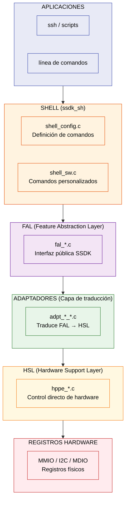

# QCA-SSDK:     Análisis desde la perspectiva de HPPE (ipq807x)


## 1. Arquitectura General del SSDK

El SSDK es una capa de abstracción de hardware que permite controlar switches Qualcomm desde Linux. Su arquitectura está organizada en capas verticales:

1.  **APLICACIONES**
2.  **SHELL**
3.  **FAL**
4.  **ADAPTADORES**
5.  **HSL**
6.  **HARDWARE**



## 1.2 

| Componente | Ubicación | Propósito |
|---|---|---|
| Definición de comandos | `shell_lib/shell_config.c` | Sintaxis de la shell |
| Comandos personalizados | `shell_lib/shell_sw.c` | Handlers especiales |
| Interfaz FAL | `fal/*.c` | Capa de abstracción |
| Implementación HPPE | `hsl/hppe/*.c` | Control de hardware IPQ8074 |
| Adaptador HPPE | `adpt/hppe/*.c` | Traducción FAL→HSL |
| Registro de APIs | `api/api_access.c` | Funciones disponibles |

---

## 2. Chips Soportados por el SSDK

Analizando el directorio `/hsl`:

| Chip | Directorio | Descripción | Plataformas |
|---|---|---|---|
| HPPE | `/hsl/hppe/` | High Performance Packet Engine | **IPQ8074**, IPQ60xx  |
| APPE | `/hsl/appe/` | Advanced Packet Processing Engine | IPQ95xx |
| MPPE | `/hsl/mppe/` | Multi-core Packet Processing Engine | IPQ53xx |
| ISIS | `/hsl/isis/` | Integrated Switch IP Solution | AR83xx (AR8327, AR8337) |
| ISISC | `/hsl/isisc/` | ISIS Compact | S17C |
| DESS | `/hsl/dess/` | Data Engine Switch Solution | DESS chips |
| MHT | `/hsl/mht/` | Multi-Host Technology | MHT chips |
| Shiva | `/hsl/shiva/` | Shiva chips | Shiva |
| Garuda | `/hsl/garuda/` | Garuda chips | Garuda |
| Horus | `/hsl/horus/` | Horus chips | Horus |
| Athena | `/hsl/athena/` | Athena chips | Athena |


> Cada chip tiene su propia implementación de todas las funciones. Unas estarán ausentes en otras, o funcionan de manera distintas.

---

## 3. Estructura de Sources

### 3.1 `/adpt` - Adaptadores

> Traducir llamadas FAL a HSL específico. Los adaptadores NO IMPLEMENTAN NADA, solo redirigen a HSL.

```
adpt/
├── hppe/                         # Adaptador HPPE (TU CHIP)
│   ├── adpt_hppe_acl.c
│   ├── adpt_hppe_flow.c       → Traduce FAL_Flow a HSL_Flow
│   ├── adpt_hppe_ip.c         → Traduce FAL_IP a HSL_IP
│   ├── adpt_hppe_portctrl.c   → Traduce FAL_Port a HSL_Port
│   └── adpt_hppe_qm.c         → Traduce FAL_QM a HSL_QM
├── appe/                         # Adaptador APPE
├── cppe/                         # Adaptador CPPE
└── ...
```


### 3.2 `/hsl/hppe` - Implementación REAL para IPQ8074

> Control directo de hardware (registros).

```
hppe/
├── hppe_global.c        → Configuración global del chip
├── hppe_init.c          → Inicialización HPPE
├── hppe_flow.c          → GESTIÓN DE FLUJOS (crítico)
├── hppe_ip.c            → RUTEO IP (donde falta ip_route_status_set)
├── hppe_portctrl.c      → Control de puertos
├── hppe_qm.c            → Colas
├── hppe_acl.c           → ACL
├── hppe_nat.c           → NAT
├── hppe_vsi.c           → VSI
├── hppe_reg_access.c    → Acceso a registros MMIO
└── ...
```


### 3.3 `/fal` - Feature Abstraction Layer

> FAL es in wrapper que redirige al HSL. Define la interfaz pública del SSDK.

```
fal/
├── fal_flow.c     → Funciones de flujo (fal_flow_mgmt_set)
├── fal_ip.c       → Funciones IP (fal_ip_route_status_set)
├── fal_nat.c      → Funciones NAT
├── fal_qm.c       → Funciones de colas
└── ...
```

- Cada `fal_*.c`:

    - Tiene funciones que llaman a `hsl_api_ptr_get(dev_id)`
    - Apunta a la API del chip
    - Llama a la función correspondiente


### 3.4 `/shell_lib` - Shell

> Interfaz de usuario
>


```
shell_lib/
├── shell.c          → Parser principal, maneja entrada de usuario
├── shell_config.c   → DEFINICIONES DE COMANDOS (donde arreglamos sintaxis)
├── shell_io.c       → Entrada/Salida de terminal
└── shell_sw.c       → Comandos personalizados (cmd_set_devid, cmd_show_*)
```

- `shell_config.c` define `gcmd_des[]` con todos los comandos y su sintaxis.


### 3.5 `/api` - API Core

> Registro de todas las funciones del SSDK que se pueden llamar desde `sw_uk_exec()`.

```
api/
├── api_access.c     → Define sw_api_func[] y sw_api_param[]
└── api_desc.h       → Definiciones de parámetros (SW_PARAM_DEF)
```


### 3.6 `/sal` - Service Abstraction Layer

> Comunicación entre kernel y userspace
> `sw_uk_exec()` termina en estas funciones, que envian comandos al kernel

```
sal/sd/linux/uk_interface/
├── sw_api_ks_ioctl.c    → Procesa ioctl desde userspace
└── sw_api_ks_netlink.c  → Procesa netlink
```


### 3.7 `/ref` - Referencia

> Implementación de referencia de FAL (cuando no hay adaptador específico).
> **Si un chip NO tiene implementación en HSL, se usa `ref`**
```
ref/
├── ref_fdb.c
├── ref_mib.c
├── ref_port_ctrl.c
└── ref_vlan.c
```


### 3.8 `/init` - Inicialización

> Inicializar el SSDK para cada chip
> Aquí se registran los adaptadores y se inicializa el hardware

```
init/
├── ssdk_hppe.c     → Inicializa HPPE
├── ssdk_appe.c     → Inicializa APPE
├── ssdk_init.c     → Inicialización genérica
└── ...
```


---

## 4.   Diagrama de Dependencias, Ejemplo `flow control set`

```mermaid
flowchart TD
    subgraph SHELL["SHELL"]
        A["<b>shell_config.c</b><br/><i>Definición de comandos</i>"] 
        B["<b>SW_API_FLOW_CTRL_SET</b><br/><i>Identificador de API</i>"]
    end

    subgraph FAL["FAL"]
        C["<b>api_access.c</b><br/><i>sw_api_func[]</i><br/>Registro de funciones"]
        D["<b>fal_flow.c</b><br/><i>fal_flow_mgmt_set()</i><br/>Capa FAL"]
    end

    subgraph ADAPT["ADAPTADORES"]
        E["<b>hsl_api_ptr_get()</b><br/><i>Obtiene API del chip</i>"]
        F["<b>hsl_api_t *p_api</b><br/><i>API específica HPPE</i>"]
        G["<b>p_api->flow_mgmt_set</b><br/><i>Puntero a función</i>"]
    end

    subgraph HSL["HSL HPPE"]
        H["<b>hppe_flow.c</b><br/><i>_hppe_flow_mgmt_set()</i><br/>Implementación HPPE"]
    end

    subgraph HW["HARDWARE"]
        I["<b>HSL_REG_ENTRY_SET()</b><br/><i>Escritura de registros</i>"]
        J["<b>MMIO / I2C / MDIO</b><br/><i>Registros físicos</i>"]
    end

    A -->|"define comando"| B
    B -->|"registrado en"| C
    C -->|"llama a"| D
    D -->|"obtiene API"| E
    E -->|"devuelve"| F
    F -->|"llama a"| G
    G -->|"implementado en"| H
    H -->|"escribe registros"| I
    I -->|"escribe"| J
    
    J -.->|"retorno"| I
    I -.->|"retorno"| H
    H -.->|"retorno"| G
    G -.->|"retorno"| F
    F -.->|"retorno"| E
    E -.->|"retorno"| D
    D -.->|"retorno"| C
    C -.->|"retorno"| B
    B -.->|"retorno"| A

    classDef shell fill:#fff3e0,stroke:#e65100,color:#000000,stroke-width:2px
    classDef fal fill:#f3e5f5,stroke:#6a1b9a,color:#000000,stroke-width:2px
    classDef adapt fill:#e8eaf6,stroke:#3949ab,color:#000000,stroke-width:2px
    classDef hsl fill:#fff8e1,stroke:#f57f17,color:#000000,stroke-width:2px
    classDef hw fill:#ffebee,stroke:#c62828,color:#000000,stroke-width:2px
    classDef return fill:#eeeeee,stroke:#9e9e9e,color:#000000,stroke-width:1px,stroke-dasharray:5

    class A,B shell
    class C,D fal
    class E,F,G adapt
    class H hsl
    class I,J hw
    linkStyle 9,10,11,12,13,14,15,16,17 stroke:#9e9e9e,stroke-width:1px,stroke-dasharray:5
```



---

## 5. Flujo de Llamada Completo (Ejemplo `flow mgmt`)

```mermaid
graph TD
    subgraph S1 ["1. Entrada de Usuario"]
        direction LR
        A1["Usuario: ssdk_sh flow mgmt set 0 3 rdtcpu no no yes 0"]
    end
    A1 --> B1
    subgraph S2 ["2. Shell Parsing"]
        direction LR
        B1["<code>shell.c: cmd_parse()</code>"] --> B2["<code>shell_config.c: gcmd_des[]</code>"] --> B3["<code>SW_API_FLOW_CTRL_SET</code>"]
    end
    B3 --> C1
    subgraph S3 ["3. Shell Execution Lookup"]
        direction LR
        C1["<code>shell.c: cmd_exec_api()</code>"] --> C2["<code>sw_api_func_find(SW_API_FLOW_CTRL_SET)</code>"]
    end
    C2 --> D1
    subgraph S4 ["4. API Access Dispatcher"]
        direction LR
        D1["<code>api_access.c: sw_api_func[]</code>"] --> D2["<code>fal_flow_mgmt_set</code>"]
    end
    D2 --> E1
    subgraph S5 ["5. Forwarding Abstraction Layer (FAL)"]
        direction LR
        E1["<code>fal_flow.c: fal_flow_mgmt_set(dev_id, type, dir, mgmt)</code>"]
    end
    E1 --> F1
    subgraph S6 ["6. Adaptation Layer (HPPE)"]
        direction LR
        F1["<code>adpt_hppe_flow.c: adpt_hppe_flow_mgmt_set()</code>"]
    end
    F1 --> G1
    subgraph S7 ["7. Hardware Support Layer (HSL) Pointer"]
        direction LR
        G1["<code>hsl_api_ptr_get(dev_id)</code>"] --> G2["<code>p_api->flow_mgmt_set</code>"]
    end
    G2 --> H1
    subgraph S8 ["8. HPPE Flow Execution"]
        direction LR
        H1["<code>hppe_flow.c: _hppe_flow_mgmt_set()</code>"] --> H2["ESCRIBE REGISTROS"]
    end
    H2 --> I1
    subgraph S9 ["9. Register Access Layer"]
        direction LR
        I1["<code>hsl_reg_access.c: HSL_REG_ENTRY_SET()</code>"] --> I2["MMIO"]
    end
    I2 --> J1
    subgraph S10 ["10. Kernel & Hardware"]
        direction LR
        J1["KERNEL"] --> J2["ioctl"] --> J3["HARDWARE"]
    end
    classDef user fill:#e1f5fe,stroke:#01579b,stroke-width:2px,color:#01579b;
    classDef code fill:#f5f5f5,stroke:#424242,stroke-width:1px,color:#212121;
    classDef hw fill:#ffebee,stroke:#c62828,stroke-width:2px,color:#c62828;
    class A1 user;
    class B1,B2,B3,C1,C2,D1,D2,E1,F1,G1,G2,H1,I1 code;
    class H2,I2,J1,J2,J3 hw;
```




---


